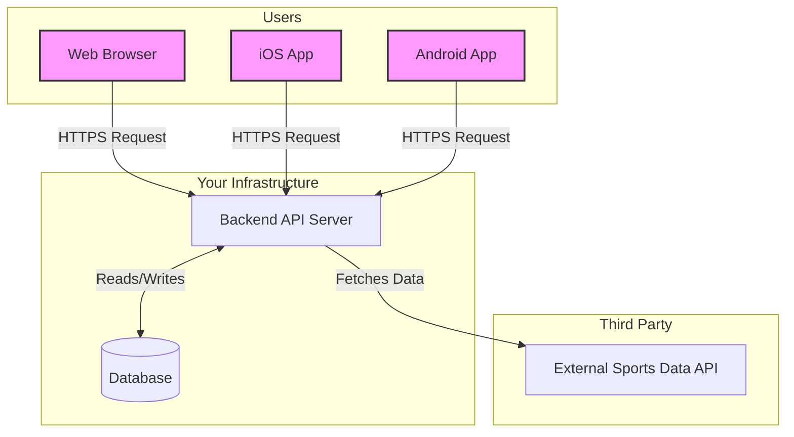

# High-Level System Architecture

This document outlines the high-level system architecture for the sporting events application. The design is based on a modern, scalable, and maintainable client-server model.

## Core Components

The system is composed of four main components:

1.  **Clients (Frontend):** These are the user-facing applications.
    *   **Web Application:** A responsive web app accessible from any modern browser.
    *   **Mobile Applications:** Native apps for iOS and Android to provide the best user experience on mobile devices.

2.  **Backend API Server:** The central nervous system of the application.
    *   It will be a RESTful or GraphQL API that serves data to the clients.
    *   It handles all business logic, including user authentication, managing personalized calendars, and processing data.

3.  **Database:** The persistent storage for the application.
    *   It will store user-specific data such as user accounts, preferences, and personalized event calendars.

4.  **External Sports Data API:** A third-party service that provides real-time sports data.
    *   This service is the source for all event schedules, live scores, and match results. Our backend will communicate with this API to fetch the data and then relay it to the clients.

## Architecture Diagram

The following diagram illustrates the flow of information between these components:

## Data Flow

1.  A user on the web or mobile app requests a list of upcoming events.
2.  The client application sends a request to our **Backend API Server**.
3.  The **Backend API Server** receives the request and fetches the required event data from the **External Sports Data API**.
4.  The **Backend API Server** may also query its own **Database** to get user-specific information, like which events the user has added to their calendar.
5.  The backend processes the data and sends a formatted response back to the client application.
6.  The client application displays the information to the user.

This architecture ensures that the logic for handling data is centralized in the backend, making it easier to maintain and scale. The clients are only responsible for presenting the data, which keeps them lightweight and focused on the user experience.