# Detailed System Architecture

This document provides detailed architectural diagrams and data flow explanations for the sports events application.

---

## System Overview

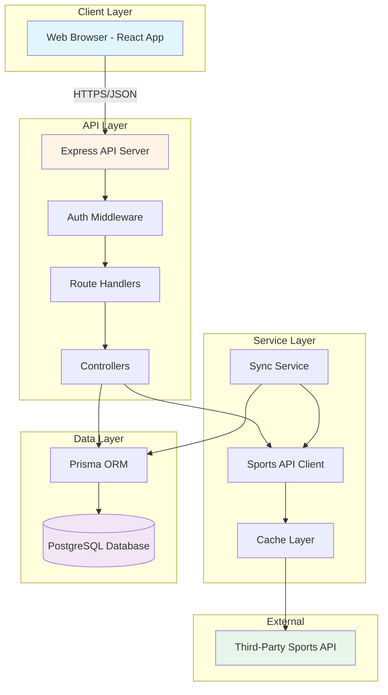

---

## Authentication Flow

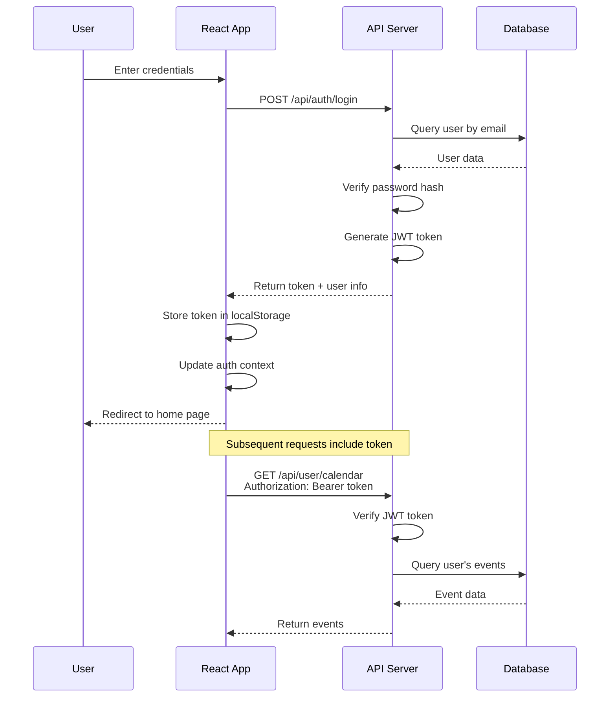

---

## Event Discovery Flow

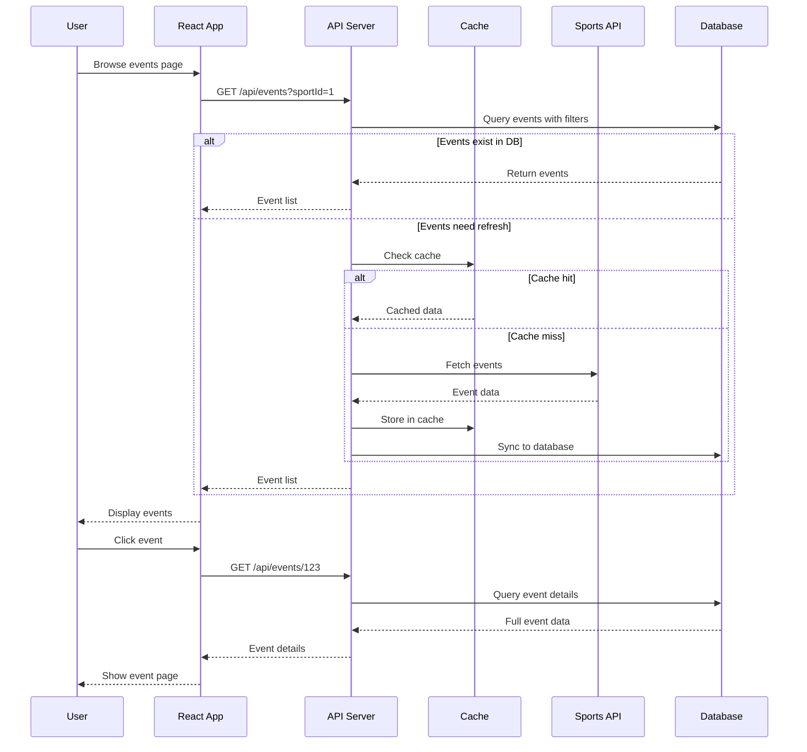

---

## Calendar Management Flow

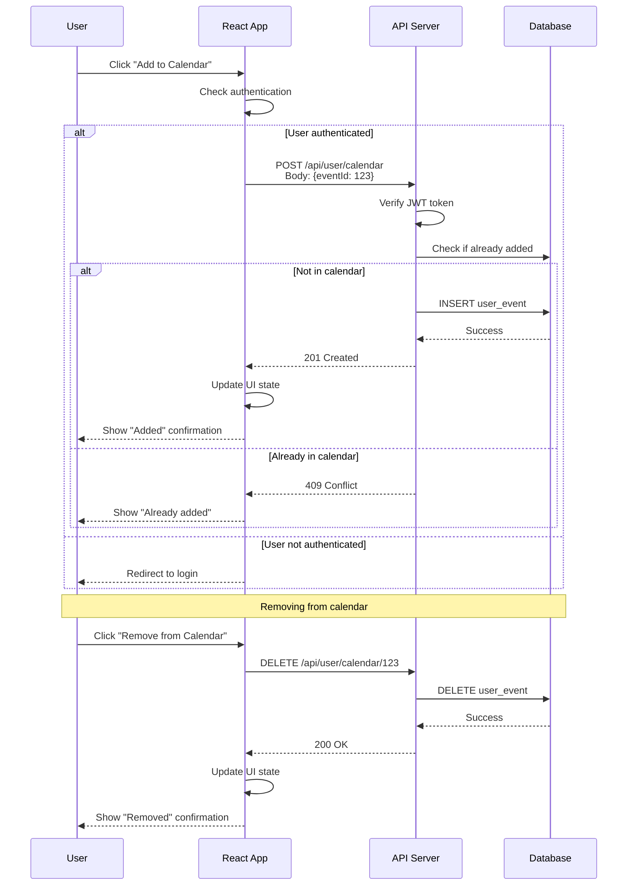

---

## Data Sync Process

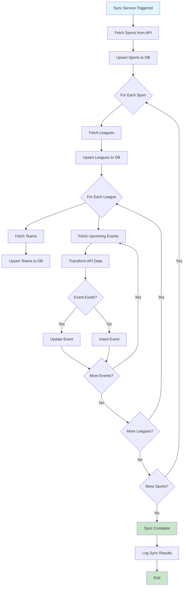

---

## Database Schema Relationships

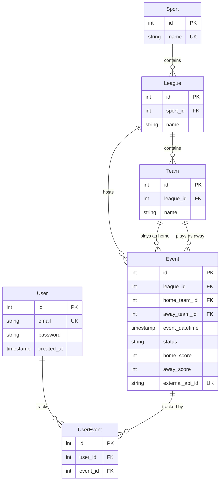

---

## Frontend Component Architecture

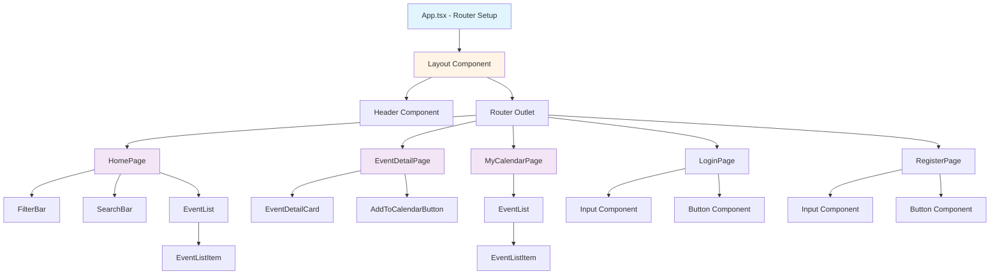

---

## API Request/Response Flow

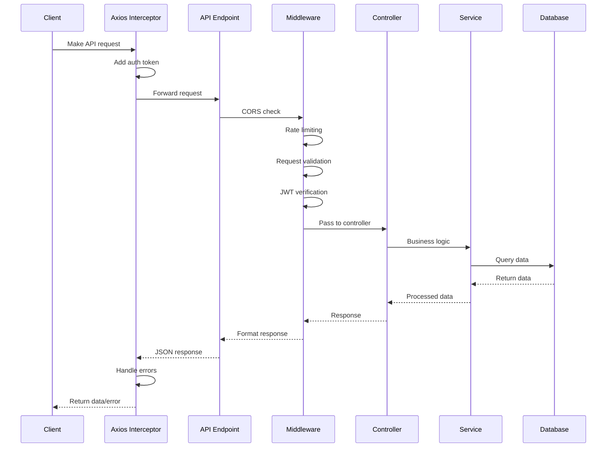

---

## Caching Strategy

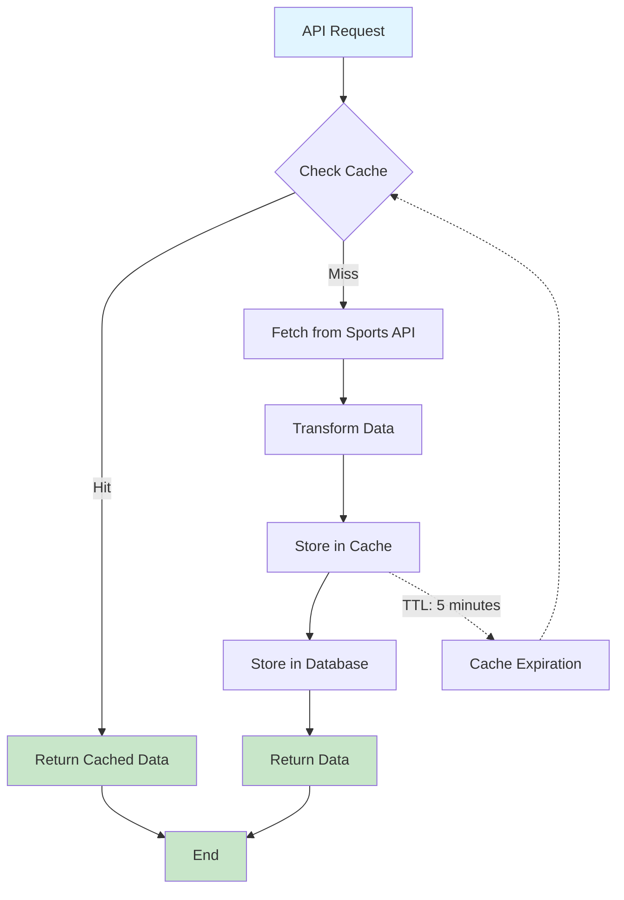

**Cache Configuration**:
- **Events**: 5 minutes TTL (frequently updated)
- **Teams/Leagues**: 1 hour TTL (rarely change)
- **Sports**: 24 hours TTL (static data)

---

## Error Handling Flow

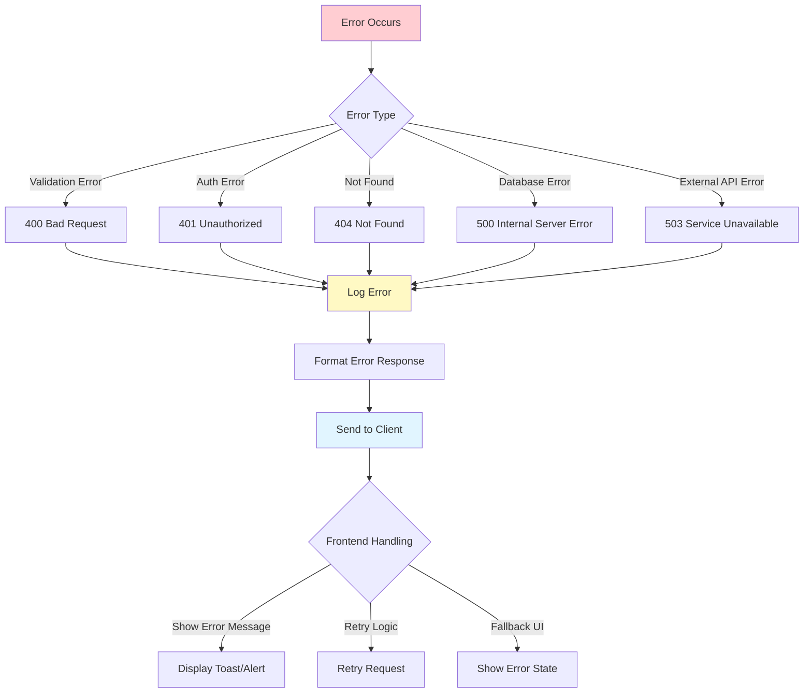

---

## Security Layers

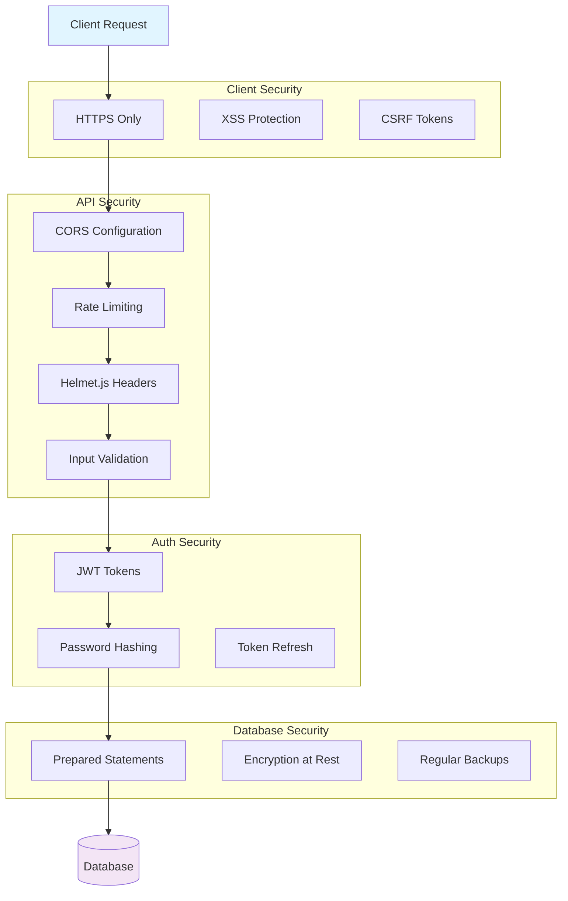

---

## Deployment Architecture

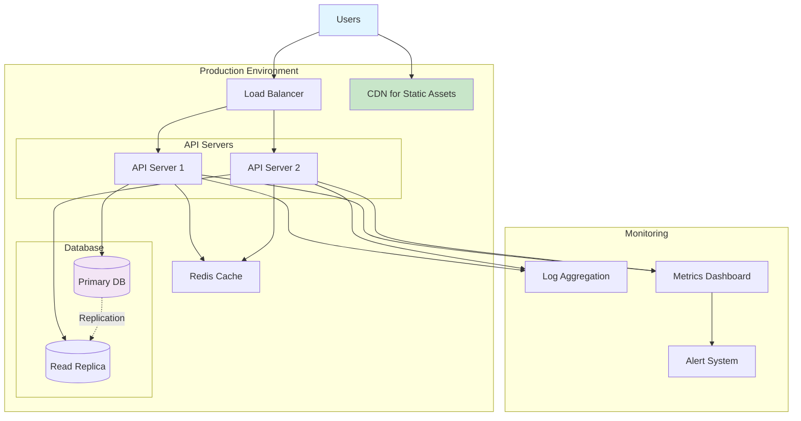

---

## Performance Optimization Strategy

### Backend Optimizations
1. **Database Indexing**
   - Index on `event_datetime` for date queries
   - Index on `league_id` for filtering
   - Index on `external_api_id` for sync operations
   - Composite index on `user_id + event_id` for calendar queries

2. **Query Optimization**
   - Use Prisma's `select` to fetch only needed fields
   - Implement pagination for large result sets
   - Use `include` strategically to avoid N+1 queries

3. **Caching**
   - In-memory cache for frequently accessed data
   - Redis for distributed caching (production)
   - Cache invalidation on data updates

4. **API Rate Limiting**
   - Limit external API calls
   - Implement request queuing
   - Use batch operations where possible

### Frontend Optimizations
1. **Code Splitting**
   - Lazy load routes
   - Dynamic imports for heavy components

2. **Asset Optimization**
   - Image optimization and lazy loading
   - Minification and compression
   - CDN for static assets

3. **State Management**
   - Minimize re-renders
   - Use React.memo for expensive components
   - Implement virtual scrolling for long lists

4. **Network Optimization**
   - Request debouncing for search
   - Optimistic UI updates
   - Background data prefetching

---

This detailed architecture provides a comprehensive view of how all components interact and the strategies employed for security, performance, and scalability.